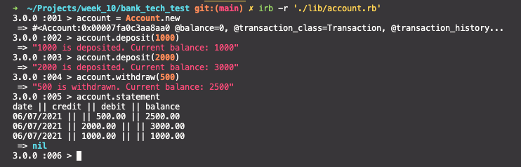

# Bank tech test

## Running the program
### Setup

1. Clone this repo.
3. Install dependencies with:

   ```bash
   bundle
   ```

3. Run tests:

   ```bash
   rspec
   ```

4. Launch IRB:

   ```bash
   irb
   ```

   Once in IRB.

   ```irb
   require './lib/account.rb'
   account = Account.new
   ```

   ## Gems

Testing and Development gems are:

| Gem               | Description                                       |
| ----------------- | ------------------------------------------------- |
| rspec             | Testing framework                                 |
| rubocop           | Linter, checks for code quality and conventions   |
| simplecov         | Measures test coverage                            |
| simplecov-console | Displays measured test coverage when rspec is run |

### Simplecov and Rubocop

Added simplecov and simplecov console gems and configured them in `spec_helper.rb` to check code coverage (better late than never). Also added `coverage` to `.gitignore`.

Linting all files with Rubocop led to minor formatting fixed (also added Rubocop to gems so anyone can run these tests).

## Specification

### Requirements

* You should be able to interact with your code via a REPL like IRB or the JavaScript console.  (You don't need to implement a command line interface that takes input from STDIN.)
* Deposits, withdrawal.
* Account statement (date, amount, balance) printing.
* Data can be kept in memory (it doesn't need to be stored to a database or anything).

### Acceptance criteria

**Given** a client makes a deposit of 1000 on 10-01-2012  
**And** a deposit of 2000 on 13-01-2012  
**And** a withdrawal of 500 on 14-01-2012  
**When** she prints her bank statement  
**Then** she would see

```
date || credit || debit || balance
14/01/2012 || || 500.00 || 2500.00
13/01/2012 || 2000.00 || || 3000.00
10/01/2012 || 1000.00 || || 1000.00
```

### CRC Cards 

| Class Name:               | Account        |
|---------------------------|----------------|
| Reponsibilities:          | Collaborators: |
| Knows Balance             | Transaction    |
| Knows transaction history |    Printer     |
| Can Deposit               |                |
| Can Withdraw              |                |
| Can Print statement       |                |

| Class Name:                       | Transaction    |
|-----------------------------------|----------------|
| Reponsibilities:                  | Collaborators: |
| Knows Date                        |     Printer    |
| Knows Credit Amount               |                |
| Knows Debit Amount                |                |
| Knows Balance (after transaction) |                |

| Class Name:                       | Printer        |
|-----------------------------------|----------------|
| Reponsibilities:                  | Collaborators: |
| Formats Time                      |                |
| Formats Transaction Row           |                |
| Formats Statement                 |                |

## User Stories
```
As a customer,
So I can make a transaction,
I want to create bank account with a balance of 0
```
```
As a customer,
So I can keep my money safe,
I want to deposit money into my account 
```

```
As a customer,
So I can spend money,
I want to withdraw money from my account 
```

```
As a customer,
So I do not have a negative balance,
I want to withdraw only the money that I have 
```

```
As a customer,
So I can see my balance and transaction history,
I want to print account statement
```

```
As a Customer,  
So I know when each transaction happened,  
I want transactions on my statement to have the date
```

```
As a Customer,  
Because more recent transactions are more important to me,  
I want the statement transactions to be ordered chronologically from the latest to the oldest.
```

## Screen Preview


## Approach
* First I created user stories based on requirements and acceptance criteria
* Based on user stories I made my planning and structured my code

| Class          | Account      | Transaction  | Printer    |
| :------------- | :----------- | :----------- | :----------- |
| Attributes | balance, transaction_class, transaction_history, formatter | date, debit, credit, balance, formatter | |
| Methods | deposit, withdraw, statement | show | format_row, format_time, format_statement |

* Classes are defined based on nouns in user stories. They are: Account, Transaction (which summarises deposit and withdrawals), and Printer. 
* Account class creates new instances of Transaction when user makes a deposit or a withdrawal. Account stores balance and transaction history. Account also has formatter, which is Printer class injected to it, to delegate formatting and printing of the statement method. 
* Initially, tests were testing state of @balance rather than behaviour. Reworked tests to test whether deposit and withdraw methods were showing expected behaviour (apart from changing the balance): whether they were adding debit or credit transaction into Account's transaction history.
* Refactored Account's deposit and withdraw methods extracting logic using private helper methods.
* Made an assumption that deposit and withdraw methods would output relevant confirmation message to stdout for a user-friendly interface (although it can be argued that presenting information to the user is not the job of the Account class). This logic has been extracted to private helper methods within the class. 
* Transaction class stores information about date (defaults to Time.now if no value is given), debit amount, credit amount, and resulting balance. The latter three attributes default to nil if no value is given. 
* Printer instance is injected into Account class to enable account class to delegate formatting and printing statement. It is also initialised in Transaction class to format/print a new row of transaction with date, credit, debit and balance as a new row.
* All unit tests are isolated using mocks and doubles. Time.now is stubbed to control randomness. 
* Each RGR cycle is committed using frequent commits and descriptive commit messages. 
* Included an integration test to test functionality of the entire program. 
* Made an assumption that customer cannot withdraw money unless there is enough money in their account and added this edge case in the project using a guard clause. 
* Account initialise method sets @balance with new constant STARTING_BALANCE as 0.
* Used TDD throughout the entire process. Test coverage is 100%. 